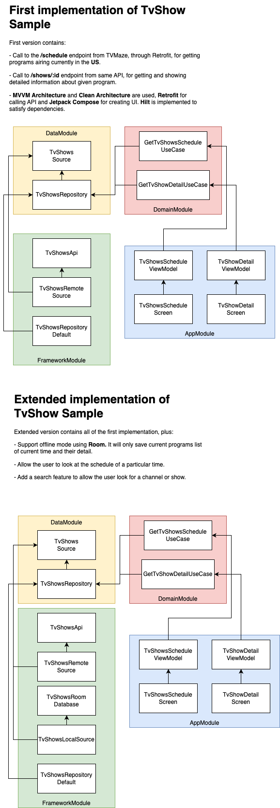

# TvShowsSample

This is my trial for Brightcove Assessment
This app allows the users to get programs in the US. In the following figure, you can find the developed architecture:



## Getting Started

In this section you can find Instructions for how to get a copy of the project running on your local machine.

### Dependencies

```
- Android studio Hedgehog
- Gradle 8.2
```

### Installation

Step by step explanation of how to get a dev environment running.

```

```

## Built With

* [Hilt](https://developer.android.com/training/dependency-injection/hilt-android) - API for DI.
* [Retrofit](https://square.github.io/retrofit/) - API for REST requests.
* [Room](https://developer.android.com/jetpack/androidx/releases/room?gclid=CjwKCAjw8KmLBhB8EiwAQbqNoCXd6QjVVIoQVtgBEoXcdVWX15xvIDldToYl7N2XRH0hYOMYWjqIWRoCUc8QAvD_BwE&gclsrc=aw.ds) - SQLite wrapper.